# Mafia Board Game

Mafia Board Game is a website designed to replace traditional paper cards for the popular party game Mafia. This online platform focuses on simplifying the moderator's tasks during the game's night phase. Moderators can input game data into a form, submit it, and receive updated data back. The backend then analyzes the data using an algorithm and sends the updated information to the frontend.

## Features

- Avatar selection for users
- Inclusion of new roles to enrich gameplay
- Simplified moderator tasks during the night phase

## Installation

No installation is required as Mafia Board Game is a web-based application. Simply visit [Website URL] to access the platform.

## Usage

1. Sign up or log in to the Mafia Board Game website.
2. Create a lobby and become the moderator/GOD.
3. Receive a unique lobby key upon lobby creation.
4. Share the lobby key with other users to join the game.
5. Input game data as the moderator during the night phase.
6. Receive updated game data and continue gameplay.

## Contributing

Contributions to Mafia Board Game are welcome! Please reach out via email [here](mailto:me@Navidr.com) to discuss any suggestions or ideas before making contributions.

## License

This project is open-source and available under the [MIT License](LICENSE).

## Additional Information

- To get started, see the screenshots provided in the [screenshots](screenshots/) directory.

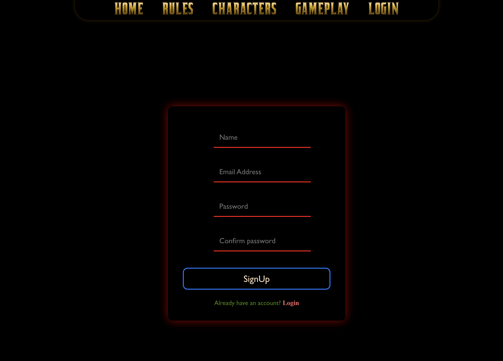
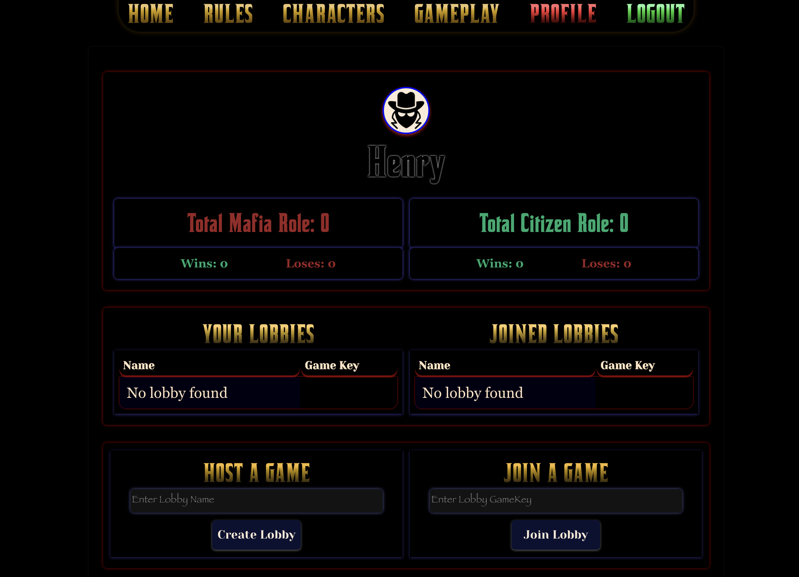
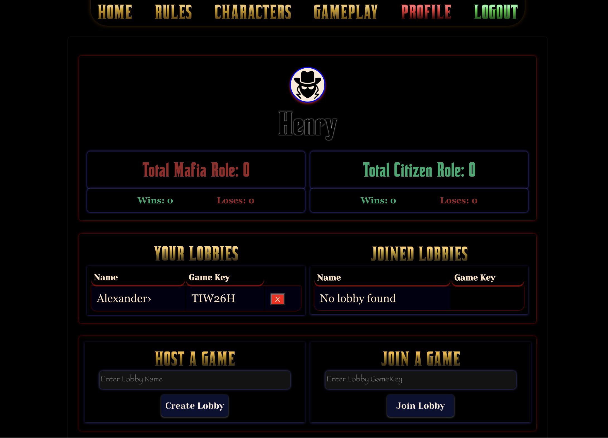
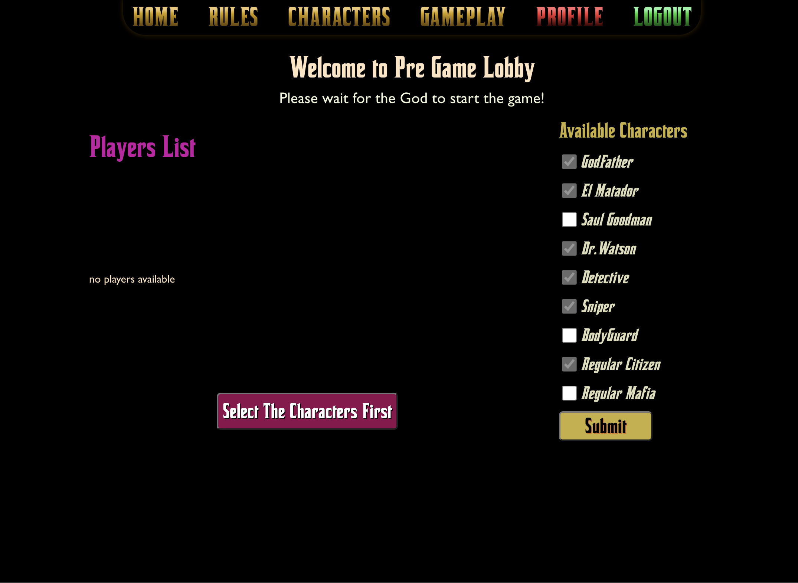
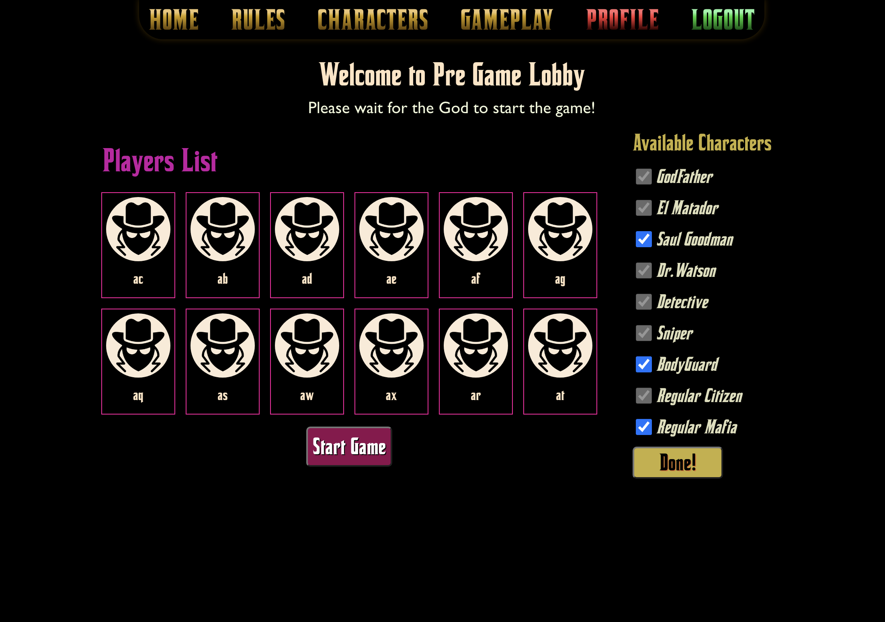
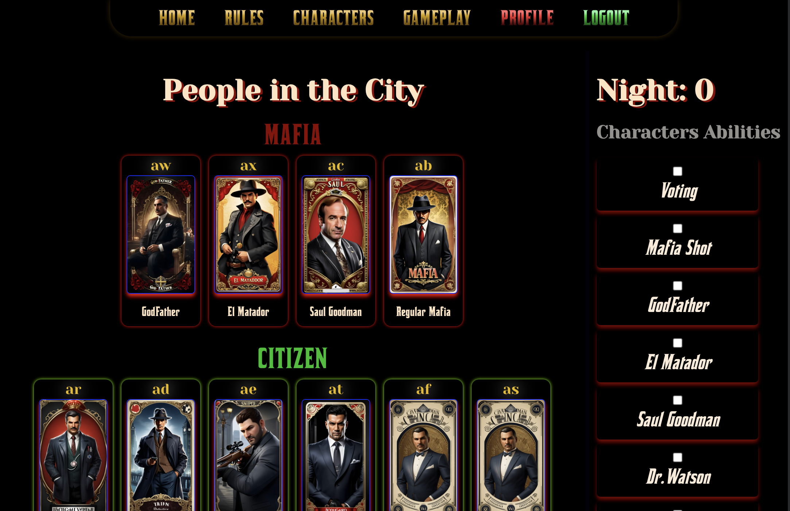
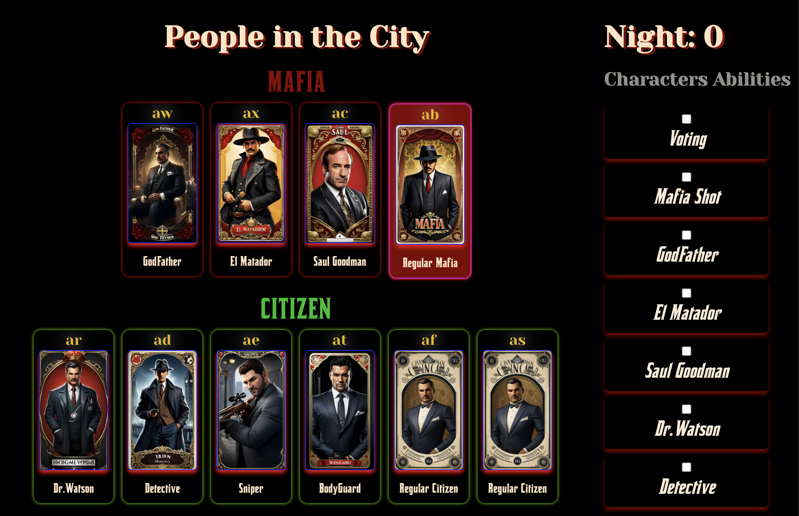
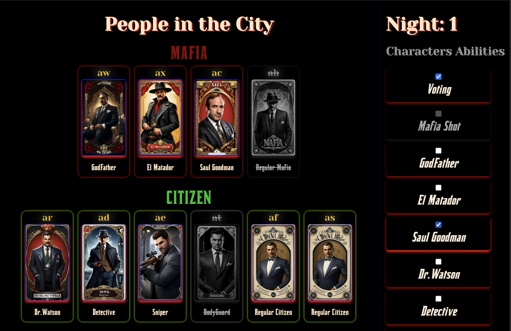
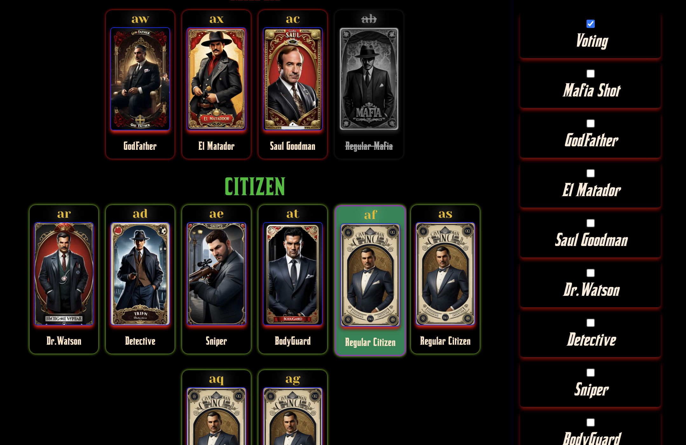
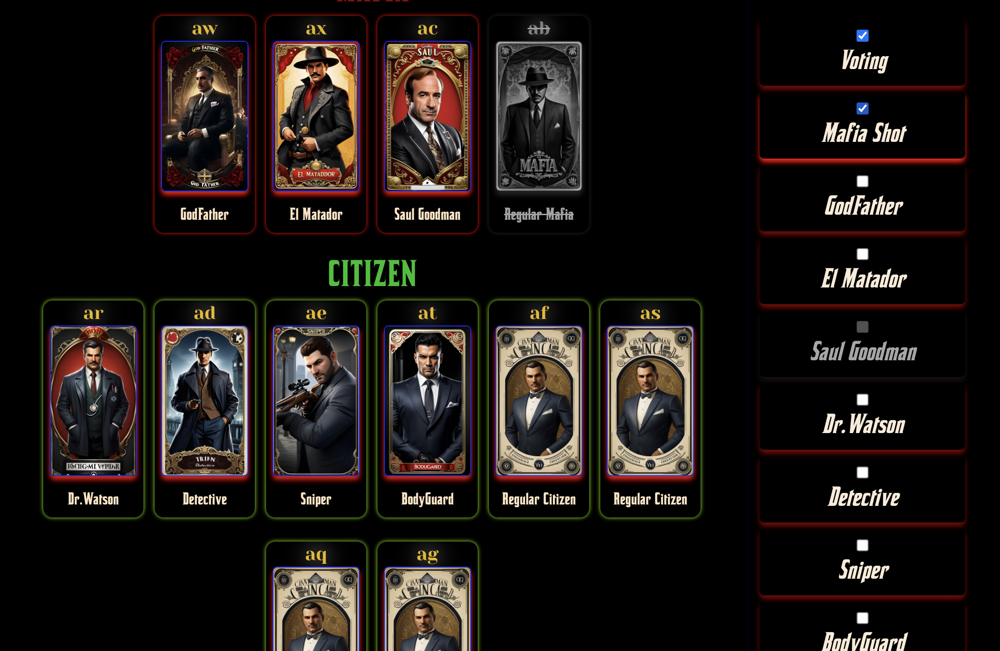
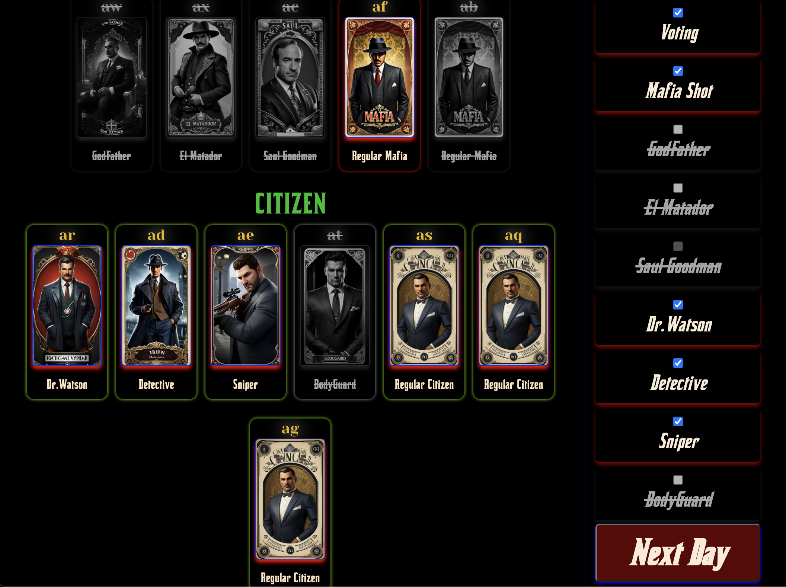
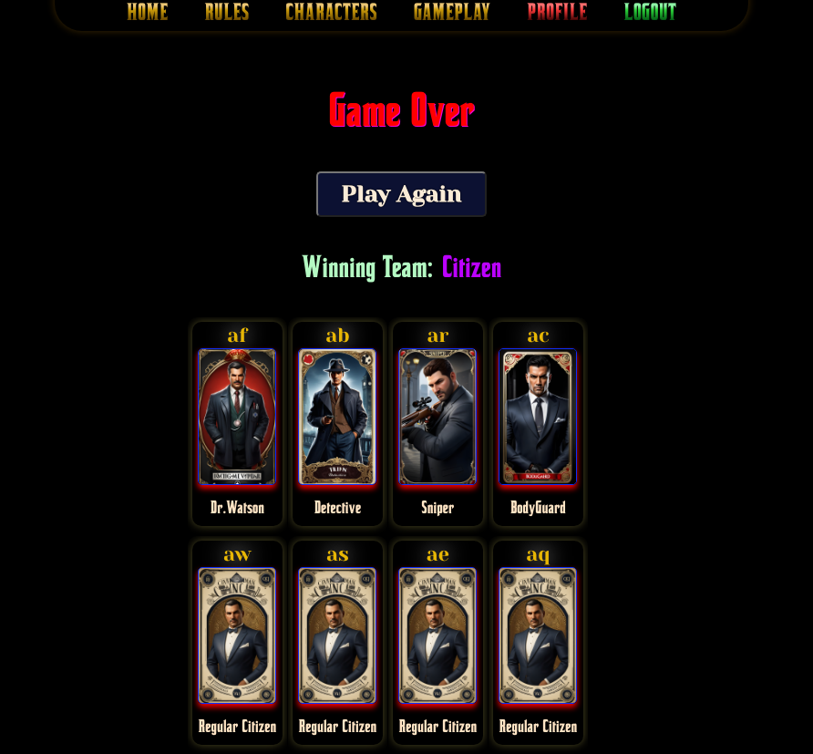

For more information about the Mafia party game, visit [Wikipedia](https://en.wikipedia.org/wiki/Mafia_(party_game)).
- For further assistance or inquiries, contact [here](mailto:me@Navidr.com).

